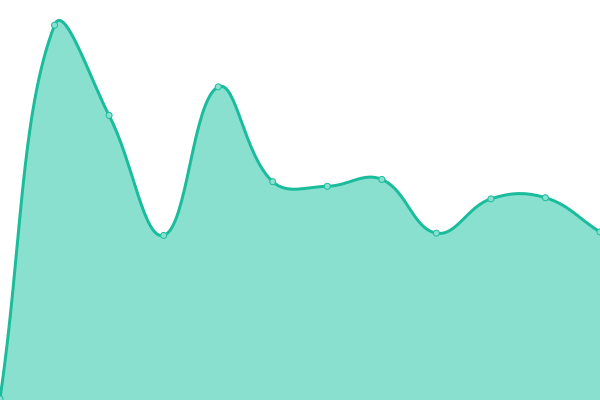

# [📈 Live Status](https://GrupoX-FIUBA.github.io/music-service-status): <!--live status--> **🟩 All systems operational**

This repository contains the open-source uptime monitor and status page for [GrupoX-FIUBA](https://GrupoX-FIUBA.github.io/music-service-status), powered by [Upptime](https://github.com/upptime/upptime).

With [Upptime](https://upptime.js.org), you can get your own unlimited and free uptime monitor and status page, powered entirely by a GitHub repository. We use [Issues](https://github.com/GrupoX-FIUBA/music-service-status/issues) as incident reports, [Actions](https://github.com/GrupoX-FIUBA/music-service-status/actions) as uptime monitors, and [Pages](https://GrupoX-FIUBA.github.io/music-service-status) for the status page.

<!--start: status pages-->
<!-- This summary is generated by Upptime (https://github.com/upptime/upptime) -->
<!-- Do not edit this manually, your changes will be overwritten -->
<!-- prettier-ignore -->
| URL | Status | History | Response Time | Uptime |
| --- | ------ | ------- | ------------- | ------ |
|  Music Service | 🟩 Up | [music-service.yml](https://github.com/GrupoX-FIUBA/services-status/commits/HEAD/history/music-service.yml) | 

 2347ms
     
 | 

<a href="https://status.spotifiuby.com.ar/history/music-service">99.72%</a>
    

|  Users Service | 🟩 Up | [users-service.yml](https://github.com/GrupoX-FIUBA/services-status/commits/HEAD/history/users-service.yml) | 

 7395ms
     
 | 

<a href="https://status.spotifiuby.com.ar/history/users-service">99.72%</a>
    

|  Feedback Service | 🟩 Up | [feedback-service.yml](https://github.com/GrupoX-FIUBA/services-status/commits/HEAD/history/feedback-service.yml) | 

 2586ms
     
 | 

<a href="https://status.spotifiuby.com.ar/history/feedback-service">99.72%</a>
    

|  Payments Service | 🟩 Up | [payments-service.yml](https://github.com/GrupoX-FIUBA/services-status/commits/HEAD/history/payments-service.yml) | 

 2086ms
     
 | 

<a href="https://status.spotifiuby.com.ar/history/payments-service">99.72%</a>
    

|  API Gateway | 🟩 Up | [api-gateway.yml](https://github.com/GrupoX-FIUBA/services-status/commits/HEAD/history/api-gateway.yml) | 

 1925ms
     
 | 

<a href="https://status.spotifiuby.com.ar/history/api-gateway">98.22%</a>
    

<!--end: status pages-->

[**Visit our status website →**](https://GrupoX-FIUBA.github.io/music-service-status)

## 📄 License

- Powered by: [Upptime](https://github.com/upptime/upptime)
- Code: [MIT](./LICENSE) © [GrupoX-FIUBA](https://GrupoX-FIUBA.github.io/music-service-status)
- Data in the `./history` directory: [Open Database License](https://opendatacommons.org/licenses/odbl/1-0/)
